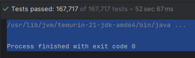
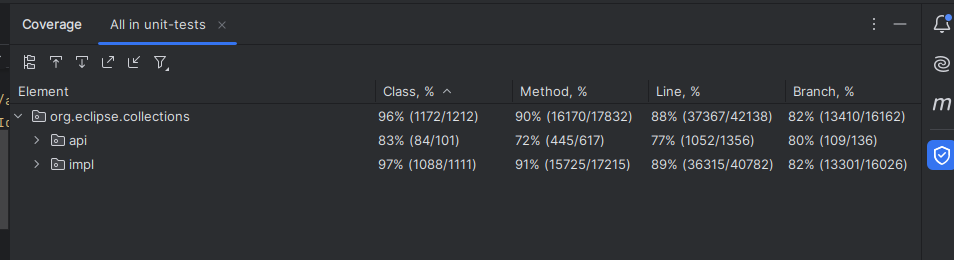
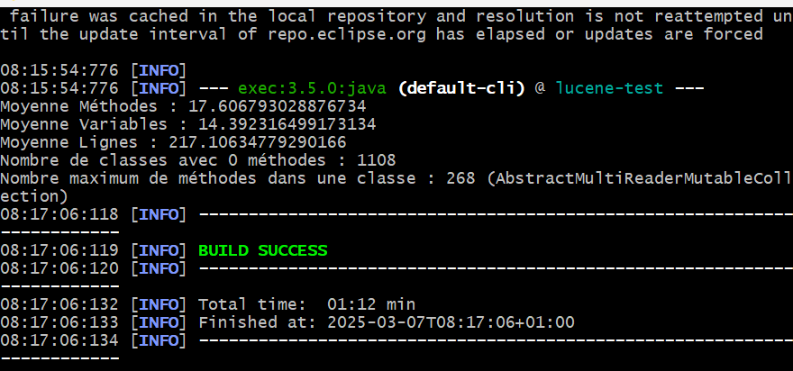
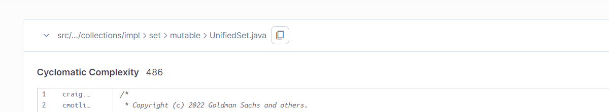
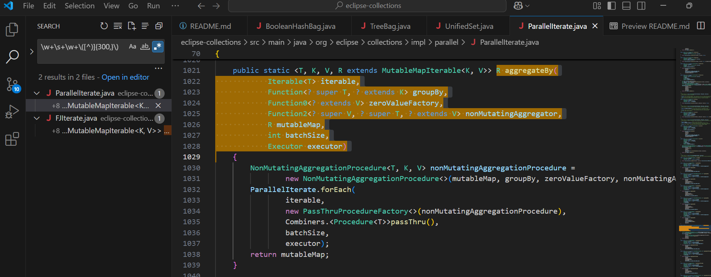
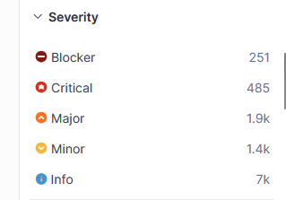

# Analyse de Eclipse Collection
# Contexte du Projet
Pendant les cours de génie logiciel, nous avons dû réaliser, en binôme, une analyse du code de la bibliothèque Java Eclipse Collections, que vous pouvez consulter ci-dessous.

## Auteur :
TARTARE Théophane

Vanelsland Marvin
## Sommaire
- [Introduction](#introduction)  
    - [Le projet](#Le-projet)  
    - [Outils utilisés](#outils-utilisés)
    - [Utilisation de Lucene](#Utilisation-de-Lucene)
      
- [1 Présentation globale du projet](#1-présentation-globale-du-projet)  
    - [1.1 Utilité du projet](#11-utilité-du-projet)  
    - [1.2 Description du projet](#12-description-du-projet)  
- [2 Historique du logiciel](#2-historique-du-logiciel)  
    - [2.1 Analyse du git](#21-analyse-du-git)  
- [3 Architecture logicielle](#3-architecture-logicielle)  
    - [3.1 Utilisation de bibliothèques extérieures](#31-utilisation-de-bibliothèques-extérieures)  
    - [3.2 Organisation en paquetages](#32-organisation-en-paquetages)  
    - [3.3 Répartition des classes dans les paquetages](#33-répartition-des-classes-dans-les-paquetages)  
    - [3.4 Organisation des classes](#34-Organisations-des-classes)  
- [4 Analyse approfondie](#4-analyse-approfondie)  
    - [4.1 Tests](#41-tests)  
    - [4.2 Commentaires](#42-commentaires)  
    - [4.3 Dépréciation](#43-dépréciation)  
    - [4.4 Duplication de code](#44-duplication-de-code)  
    - [4.5 God Classes](#45-god-classes)  
    - [4.6 Analyse des méthodes](#46-analyse-des-méthodes)  
- [5 Nettoyage de code et code smells](#5-nettoyage-de-code-et-code-smells)   
    - [5.1 Règles de nommage](#51-règles-de-nommage)  
    - [5.2 Nombres magiques](#52-nombres-magiques)  
    - [5.3 Code mort](#53-code-mort)  
- [Résumé](#résumé) 
- [Difficultés rencontrées](#difficultés-rencontrées)  


# Introduction
## Le projet
Etant impossible de directement mettre le projet dans ce dépot git, voici un lien vers le git du projet etudié. 

[git-Eclipse Collection](https://github.com/eclipse-collections/eclipse-collections)


## Outils utilisés
Pour faire cette analyse et obtenir nos informations nous avons utiliser :

- SonarQube 
- Maven
- Java
- VisualStudio
- Lucene
- IntelliJ


### Utilisation de Lucene
Pour utiliser les fichiers Lucene, veuillez ajouter le dossier lucene-test présent dans le clone de eclipse-collections. Ensuite, dans le fichier pom.xml principal de eclipse-collections, ajoutez la ligne suivante dans les modules  

``` <module>lucene-test</module> ```

Enfin, en utilisant un terminal, allez dans le répertoire *./chemin/eclipse-collections* et exécutez la commande suivante :  

``` mvn clean install ```

Maintenant, allez dans *lucene-test/src/main/java* et dans tous les fichiers, changez la variable projectPath en celui de votre machine.

Une fois cela terminé, allez dans *./chemin/eclipse-collections/lucene-test* et exécutez la commande suivante :  

``` mvn compile ```

Vous pouvez maintenant exécuter les fichiers. Pour ce faire, par exemple, pour exécuter *PackageAnalyze*, toujours dans *./chemin/eclipse-collections/lucene*, exécutez la commande suivante :

``` mvn exec:java -Dexec.mainClass="PackageAnalyzer" ```

# Partie 1

## 1 Présentation globale du projet

### 1.1 Utilité du projet
Eclipse Collections est une bibliothèque Java qui enrichit le langage Java en ajoutant des structures de données avancées comme par exemple Bag, Multimap, BiMap, et Interval. Il y a bien sur une compatibilité avec les collections de java.util.


On utilise Eclipse Collections en l’ajoutant dans le fichier pom.xml (si le projet est basé sur Maven) comme ceci:

```
<dependency>
  <groupId>org.eclipse.collections</groupId>
  <artifactId>eclipse-collections-api</artifactId>
  <version>11.1.0</version>
</dependency>
```

Le projet n'a pas de "résultat" à proprement parler, car il s'agit d'une bibliothèque, mais nous avons bien accès aux nouvelles structures de données. Par exemple :

```
import org.eclipse
collections.api.list.primitive.IntList;

IntList numbers = IntArrayList.newListWith(1, 2, 3, 4, 5);
```

### 1.2 Description du projet

Le projet possède un Readme.md qui nous apprend ce que le projet est, comment l'installer et comment l'utiliser notamment avec des exemples de code et des liens vers la javadoc. Cependant, il y a beaucoup de liens externes au projet, et il serait peut-être préférable d'intégrer ces informations directement dans le fichier *README.md*. Aussi il n'y a pas de tutoriel pour compiler, générer la javadoc et lancer les tests. Actuellement, il est nécessaire de copier-coller des lignes de code sans explication claire sur la procédure complète à suivre .


## 2 Historique du logiciel
### 2.1 Analyse du git
Le projet comporte 100 contributeurs pour un total de 2 299 commits. On peut remarquer que seulement 3 personnes ont plus de 100 commits, et 8 personnes ont plus de 20 commits. Cela peut s'expliquer par le fait que les développeurs ont accepté des contributions de personnes extérieures à l'équipe de base. Le projet compte 18 branches et a enregistré 35 pull requests.


On remarque que, depuis sa création, le projet a été maintenu et amélioré pendant près de 10 ans.  
Cependant, il semble être moins mis à jour depuis 2025, avec un dernier commit datant de 4 mois (au 11/11/2024).  
Cette bibliothèque a connu 11 versions majeures. Actuellement, Eclipse Collections est en version 11.1.0, sortie le 6 juillet 2022, dont l’objectif était d’ajouter des API et quelques nouvelles fonctionnalités.  


## 3 Architecture logicielle

### 3.1 Utilisation de bibliothèques extérieures.
Ce projet comporte 192 dépendances, dont 86 sont des dépendances interne, les autres dépendances sont utilisées pour gérer diverses fonctionnalités. Parmi ces dépendances externes, on retrouve des bibliothèques bien connues telles que Guava, utilisée pour fournir des outils de programmation, ou JUnit, une bibliothèque permettant de gérer les tests. Ces bibliothèques permettent de gagner du temps et de simplifier le code, évitant ainsi de réinventer la roue.


### 3.2 Organisation en paquetages.
Il y a 229 paquetages, ce qui est élevé. Cependant, ils sont répartis en couches, ce qui permet une réutilisation des couches supérieures dans plusieurs couches inférieures. Pour cela, les paquetages sont organisés sur un maximum de 6 à 7 niveaux. De plus, les tests suivent aussi une organisation en couches similaire à celle du code implémenté, ce qui facilite la recherche du test correspondant à la classe que l'on souhaite examiner.

Depuis le nom des paquetages, on peut déterminer que certains design patterns ont été utilisés dans ce projet. Par exemple, le paquetage *org.eclipse.collections.impl.factory* peut suggérer l'utilisation du pattern Factory. De manière plus générale, les noms des paquetages suivent les bonnes pratiques en nous informant sur le rôle que jouent les classes qui y appartiennent dans le projet.

### 3.3 Répartition des classes dans les paquetages 
Le projet comporte 1,264 classes. Le nombre minimum de classes dans un paquetage est de 0, et le maximum est de 7, pour une moyenne de 3,23 classe par paquetage. Cela est relativement bas, ce qui peut indiquer une volonté de bien séparer les classes et de les placer au bon endroit, plutôt que de tout regrouper sous un même paquetage. Cela tend à suggérer que le code est ouvert à des améliorations.

Nous allons analyser le couplage et la cohésion au sein de deux paquetages. Étant donné que de nombreuses classes importent un grand nombre d'autres classes, il est irréaliste de calculer le couplage en utilisant la formule vue en cours. De plus, nous n'avons pas réussi à installer un outil nous permettant de le mesurer précisément. Cependant, nous pouvons tout de même faire des prédictions assez justes en analysant le code.

Le paquetage *org.eclipse.collections.impl.string.immutable* devrait présenter une cohésion élevée, car les trois classes qui le composent implémentent des interfaces soit identiques (CharSequence, Serializable), soit similaires dans leur nom et donc potentiellement dans leur rôle (ImmutableIntList, ImmutableCharList). De plus, leur nom contient le terme Adapter, ce qui suggère une fonction commune.  

   

Cependant, le nombre élevé d'importations nous indique que le couplage est lui aussi très élevé, ce qui n'est pas idéal.


Le paquetage *org.eclipse.collections.impl.block.function.primitive* devrait avoir une cohésion élevée, car toutes les classes et interfaces qu'il contient sont liées à la manipulation des types de données primitifs (int, double, char, etc.).

À l'inverse du paquetage précédent, il devrait présenter un couplage faible en raison du très faible nombre d'importations, ce qui est un bon indicateur de modularité et de séparation des responsabilités.  
  
Cependant, nous ne pouvons pas en être totalement certains, car il faudrait vérifier les dépendances des classes qui l’utilisent. Cela suggère tout de même que ce paquetage est relativement indépendant.  


### 3.4 Organisations des classes
Concernant la hiérarchie des classes, elle est relativement faible, car bien que certaines classes aient une hiérarchie allant jusqu'à 7 niveaux, la majorité des classes présentent une hiérarchie moins profonde. Cela suggère une structure plutôt plate dans l'ensemble.  
  
La moyenne est faible, ce qui indique que la plupart des classes ont une hiérarchie peu profonde. Concernant le nombre d'enfants, le minimum est de 0 et le maximum est de 508, ce qui pourrait être dû soit à une erreur dans le code de Lucene, soit à la présence d'une God Class. La moyenne de 0,84 enfant par classe est assez faible, ce qui suggère une distribution relativement uniforme des responsabilités entre les classes.

Pour étudier la stabilité des classes, nous allons reprendre les deux mêmes paquetages que dans la section 3.3. Comme la stabilité peut être obtenue avec les formules suivantes :  
$I = Ce / (Ca + Ce)$  
où $Ce$ représente le couplage efférent (le nombre de dépendances sortantes de la classe), et $Ca$ représente le couplage afférent (le nombre de dépendances entrantes vers la classe).

Cette formule nous permet de mesurer la stabilité d'une classe : plus l'indice $I$ est proche de 1, plus la classe est stable.

Le paquetage *org.eclipse.collections.impl.string.immutable*, comme mentionné dans la section 3.3, présente un fort couplage efférent en raison du grand nombre d'importations. Cela signifie que les classes de ce paquetage ont de nombreuses dépendances sortantes, ce qui les rend assez instables.Mais si le couplage afférent est faible, cela pourrait indiquer une instabilité modérée.

Le paquetage *org.eclipse.collections.impl.block.function.primitive*, à l'inverse, pourrait être très stable ou moyennement stable, selon le nombre de classes d'autres paquetages qui dépendent de ces classes.

## 4 Analyse approfondie
### 4.1 Tests
Les tests sont des tests unitaires. Dans ce projet, d'après SonarQube, on trouve :
- 1 449 classes de test
- 46 676 tests unitaires
- 2,1 % de couverture de test  
  

Cependant, seulement 2% de couverture avec 46 676 méthodes de test nous a paru étrange. Nous avons donc tenté d'utiliser IntelliJ pour vérifier la couverture. 




Avec IntelliJ, nous trouvons :

-167 717 tests unitaires  
-96 % des classes couvertes par les tests  
-90 % des méthodes testées  
-88 % des lignes testées  
Ce qui convient plus à nos attente.

Ces résultats montrent une couverture de code très élevée, ce qui indique que la majorité du code est bien testé et que les tests sont bien répartis dans le projet. Cela nous montre que le projet bénéficie d'une couverture de test solide, ce qui est un bon indicateur de qualité et de robustesse du code.

## 4.2 Commentaires
Le projet contient 9 512 commentaires, ce qui correspond à 5,9 % du code. Cependant, on remarque que dans le package principal du projet (eclipse-collection), seulement 3,5 % des lignes sont commentées.En revanche, le package concernant l'API est bien plus documenté, avec 26 % de lignes commentées.  Cela nous montre que la documentation est plus présente dans les parties du code liées à l'API, ce qui est compréhensible car c'est une bibliothèque destinée à être utilisée par d'autres développeurs. Ce projet est donc naturellement plus orienté vers la compréhension de l'utilisation plutôt que vers la compréhension de la conception, un point qui peut encore être amélioré. Une meilleure documentation de la conception pourrait aider les développeurs à mieux comprendre son fonctionnement et à faciliter les modifications futures.

Il faut aussi noter que, si par exemple nous examinons le fichier *eclipse-collection/src/main/java/org/eclipse/collections/impl/counter.java*, nous remarquons que certaines méthodes n'ont pas de Javadoc pour deux raisons : premièrement, les méthodes sont tellement simples qu'elles n'ont pas besoin de documentation, et deuxièmement, ces méthodes implémentent probablement l'interface Externalizable, et la Javadoc peut alors se trouver dans ce fichier.

On remarque aussi qu'il reste 118 issues concernant des commentaires *TODO*, ce qui montre qu'il reste encore tâches à accomplir dans le projet.

## 4.3 Dépréciation
Il y a 640 issues concernant du code déprécié. En examinant les méthodes obsolètes, il semble que la plupart d'entre elles sont devenues obsolètes avec les mises à jour, car de meilleures classes ont été créées, ou bien la méthode n'est plus utile. Cela est souvent confirmé par le fait que la Javadoc indique que ces méthodes ne sont plus nécessaires. Ces dépréciations sont probablement dues à l'évolution du projet, où certaines fonctionnalités ont été améliorées ou remplacées par de nouvelles solutions plus efficaces.

```
     /*
     * @since 1.0
     * @deprecated in 6.0. Use {@link OrderedIterable#getFirst()} instead.
     */
    @Deprecated
```
Néanmoins, il faudrait nettoyer le code déprécié lorsqu'il n'est plus utile. Garder des méthodes et des classes obsolètes peut rendre le code plus difficile à maintenir dans le futur.  
## 4.4 Duplication de code
Au niveau de la duplication de code, on a :  
-16,1 % de lignes dupliquées  
-32 820 lignes au total

On remarque notamment une forte duplication dans les paquets Set (7 568 lignes) et Map (11 778 lignes), avec des fichiers comme UnifiedMap.java qui contiennent 62 % de lignes de code dupliquées.
## 4.5 God Classes
Pour les God Classes, nous avons les chiffres suivants :

-Moyenne de méthodes par classe : 17,61  
-Moyenne de variables par classe : 14,39  
-Moyenne de lignes par classe : 217,12  
-Nombre de classes sans méthode : 1 108  
-Nombre maximal de méthodes dans une classe : 268 (classe AbstractMultiReaderMutableCollection)  

En moyenne, on a 17 méthodes par classe pour 217 lignes, ce qui est assez élevé, mais pas excessif. Cependant, la classe *eclipse-collection/src/main/java/org/eclipse/collections/impl/collections/mutable/AbstractMultiReaderMutableCollection* possède 268 méthodes, ce qui est un grand nombre pour une même classe. On peut donc suspecter une God Class. En analysant cette classe, on s'aperçoit qu'elle dépend de nombreuses autres classes(avec un peu moins d'une centaine d'importations).
De plus, son nom lui-même est assez vague, ce qui peut nous mettre sur la piste d’une God Class. 

Une autre potentielle God Class serait *AbstractUnmodifiableMutableCollection*, située dans le même fichier. Elle aussi possède également un très grand nombre de méthodes et de nombreuses importations.

Une dernière potentielle God Class pourrait être *eclipse-collection/src/main/java/org/eclipse/collections/impl/bag/immutable/ImmutableArrayBag.java* pour les mêmes raisons que celles mentionnées ci-dessus. Cependant, on remarque que ses méthodes sont moins nombreuses, mais plus complexes que celles des deux autres classes.

D’après nos observations, les potentielles God Classes ont tendance à référencer un grand nombre de classes.




### 4.6 Analyse des méthodes 
Sur SonarQube, nous apprenons que la complexité cyclomatique globale du projet est de 25 414 et qu'il y a 19 886 fonctions, ce qui nous donne une complexité cyclomatique moyenne de 1,277. On en déduit que, de manière générale, dans le code, les méthodes ont toutes une complexité cyclomatique faible. Cependant, certaines méthodes présentent une complexité plus élevée ou un plus grand nombre de variables que d'autres. Nous allons maintenant analyser deux de ces fonctions.

La première méthode a été choisie car elle avait la plus grande complexité cyclomatique dans le fichier comportant la plus grande complexité cyclomatique, selon SonarQube.  
  
Ce fichier se nomme *UnifiedSet.java*, il se trouve dans *eclipse-collection/src/main/java/org/eclipse/collections/impl/bag/sorted/mutable* et la méthode se nomme *chainedAdd(T key, int index)*.

Cette méthode a une complexité cyclomatique de 15, ce qui est très élevé. Cela est dû en grande partie aux 14 `if` présents dans la fonction. De plus, on remarque qu'il y a un while(true), ce qui devrait être évité à tout prix de manière générale. La méthode n'a pas de Javadoc ni de commentaires, ce qui la rend difficile à analyser. Forcément, cette méthode est longue avec 72 lignes. Pour simplifier cette méthode, on pourrait la fractionner en plusieurs petites méthodes, notamment en ce qui concerne les `if`, et il faudrait trouver un moyen de faire disparaître le while(true) et rajouter de la Javadoc.


La deuxième fonction a été choisie car elle comporte beaucoup d'arguments(10) et a été trouvée grâce à Visual Studio Code avec le regex *\w+\s+\w+\([^)]{300,}\)*, ce qui nous a donné :  
  
Cette méthode a une complexité cyclomatique de 1 puisque qu'il n'y a qu'un seul chemin possible. Cependant, la méthode possède 10 arguments, ce qui est beaucoup. De plus, la méthode ne possède aucune Javadoc ni commentaire, ce qui, malgré la simplicité du code, pourrait nous aider à comprendre le but de la méthode. Pour finir, la méthode modifie un objet mutableMap et retourne mutableMap. Cela peut poser un problème de conception si l'on veut respecter le principe de Command-Query Separation. Il faudrait donc en faire deux méthodes.


## 5 Nettoyage de Code et Code smells
Dans ce projet, on retrouve 11 061 issues, ce qui représenterait, d’après SonarQube, un total de 122 jours de travail pour les corriger, ce qui est énorme.  
Parmi ces code smells :

-2 100 dans le code  
-8 800 pour les tests

Il y a un classement de la sévérité de ces codes :


On trouve 251 codes de type blocker, principalement dus à :

-L'utilisation de `clone()`, une méthode déconseillée car elle peut apporter de nombreux problèmes, notamment de sécurité en créeant un objet sans passer par le constructeur.  
-Des tests qui ne contiennent pas d'assertions.

On trouve 485 codes de niveau critique, principalement dus à :

-L'utilisation de plus de 7 paramètres (ce qui peut s'expliquer par la complexité de certaines méthodes).  
-La refactorisation des blocs try-catch.  

On trouve aussi 69 bugs, notamment :

-Des boucles sans condition d'arrêt correcte.  
-Des problèmes avec InterruptedException.  


On peut noter que la plupart de ces erreurs ont été codées il y a 9 ans, ce qui indique que ces problèmes n'ont pas été pris en compte ni corrigés depuis longtemps. Cela peut également suggérer qu'il n'y a pas eu de révision ou de mise à jour régulière du code, ce qui pourrait rendre la maintenance du projet plus complexe aujourd'hui.
### 5.1 Règles de nommage
Au niveau des règles et conventions de nommage:   
-657 problèmes de nommage de paramètres génériques qui ne suivent pas la convention ^[A-Z][0-9]?$  
-3 classes ayant un nom identique à celui de l'une de leurs superclasses ou interfaces  
-3 méthodes ayant un nom très proche de celles de la classe Object (toString, equals), mais sans respecter leur signature officielle  

Dans l'ensemble, les règles de nommage sont assez bien respectées, avec quelques exceptions quand meme notable.
### 5.2 Nombres magiques
Nous n'avons pas trouvé de nombres magiques, ce qui est une bonne chose. Cela montre que les développeurs ont respecté les bonnes pratiques en utilisant des constantes nommées à la place de valeurs littérales dans le code. 
### 5.3 Code mort
-33 variables affectées mais jamais utilisées  
-103 méthodes vides  
-5 méthodes avec des paramètres inutiles  
-2 champs privés jamais utilisés (dans les tests)  
-4 méthodes privées inutilisées  

Compte tenu de la taille du projet, la proportion de code mort reste minime mais nécessite un nettoyage.

# Résumé
Eclipse Collections est une bibliothèque Java robuste et bien maintenue, avec une bonne couverture des tests. Cependant, des améliorations sont possibles, notamment en matière de documentation de la conception et de nettoyage du code. Il faudrait aussi mettre à jour les parties de code dépréciées et une simplification des méthodes les plus complexes serait la bienvenu .
## Difficultés rencontrées
Nous avons rencontré de nombreuses difficultés tout au long du projet de GL.
Premièrement, nous avions initialement choisi d’analyser Guava, mais le projet s’est avéré trop volumineux. Même après plusieurs heures, il n’avait toujours pas compilé.
Ensuite, nous avons tenté d’analyser WebMagic, mais ce projet contenait des erreurs dans le code, rendant la compilation impossible.
Finalement, nous avons commencé à travailler sur Eclipse Collections, qui, lui, est analysable.

Nous avons également perdu un temps considérable à trouver comment installer et faire fonctionner certains outils, comme SonarQube et Lucene, en parallèle des changements de projet.