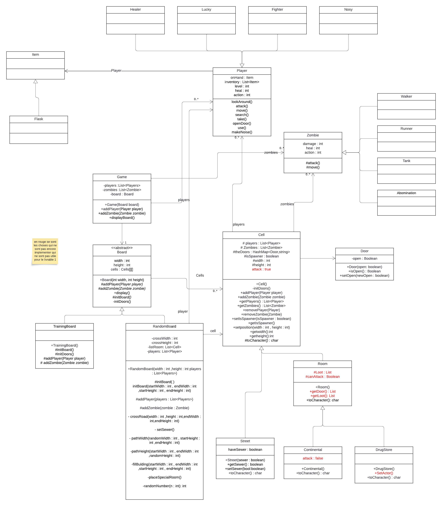
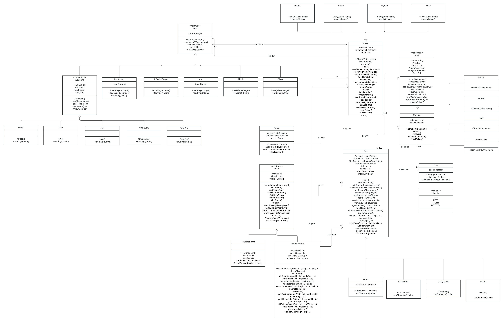
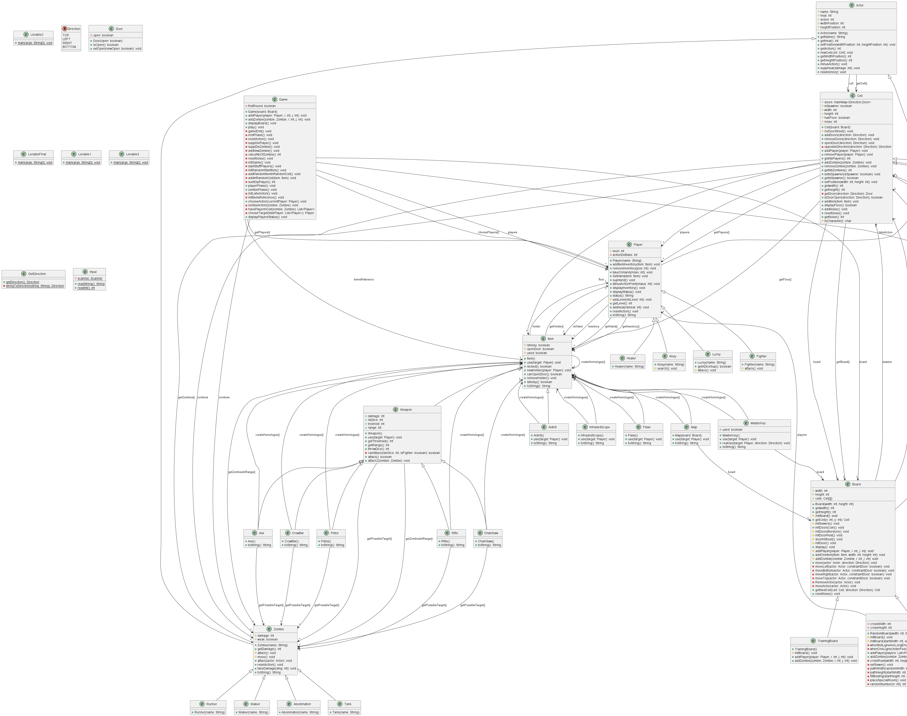
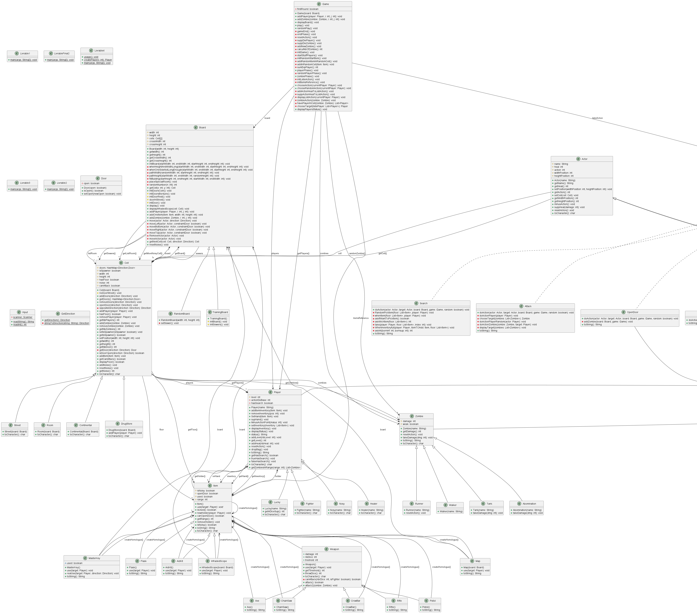

# l2s4-projet-2024

# Contexte du projet

Il s’agit du résultat de l’UE *Projet* de ma deuxième année de Licence, et de notre premier véritable travail en groupe.  

Le sujet, que vous pouvez consulter ci-dessous, demandait d’adapter le jeu **Zombicide** en Java.  

Ce projet n’est pas parfait, mais il constitue une expérience non négligeable en matière de développement en équipe.

# Equipe

- Theophane Tartare
- Lucas Reverchon
- Marvin Vanelsland
- Logan Josse

# Sujet

[Le sujet 2024](https://www.fil.univ-lille.fr/~varre/portail/l2s4-projet/sujet2024.pdf)

# Livrables

## Livrable 1
#### Choix de modélisation (voir uml)  

Concernant le plateau de jeu:
On a décidé de separé le plateau en cellule .Chaque cellules peut etre une rue ou une piece , il existe 3 type de pieces(piece normal ,le continental et la pharmacie).Chaque cellule peut contenir des joueurs et/ou des zombies.
Concernant les types de plateau de jeu:
Il existe 2 type de plateau de jeu (le tableau d'entrainement et le plateau generer aléatoirement)

### Atteinte des objectifs  
Modélisation de la ville reussi , algorithme de creation encore un probleme
### Difficultés restant à résoudre  
Il y a occasionellement des batiments de 5 de longueur ou de largeur qui ne sont pas diviser .

**générer la documentation :**  

dans ./l2s4-projet-2024/

```
javadoc -sourcepath src -subpackages zombicide -d docs
```

Pour voir la documentation d'une classe ouvrir la page html dans l2s4-projet-2024/docs/zombicide.

**Compilation**  

Pour compiler toutes les classes:

dans ./l2s4-projet-2024/

```
javac -sourcepath src src/zombicide/*.java -d classes
```

Pour compiler une classe spécifique il faut remplacé * par le nom de la classe

**Compiler et executer les test**  

Pour compiler toutes les classes:


dans ./l2s4-projet-2024/

```
javac -classpath junit-console.jar:classes test/zombicide/*.java
```

Pour compiler un test spécifique il faut remplacé * par le nom du test

Pour executer tout les tests:
dans ./l2s4-projet-2024/

```
java -jar junit-console.jar -classpath test:classes -scan-classpath
```
Une fois cette commande exécuter il faut rentrer séparemment 0, N, 0 pour que tous les tests se fassent correctement.

**Executer le Livrable1.java**  


dans ./l2s4-projet-2024/

```
java -classpath classes zombicide.Livrable1 <hauteur> <largeur>
```

Si on ne met pas de parametre cela renvoie le plateau d'entrainement
Avec 1 seul parametre n cela renvoie un plateau de taille n*n

**Creer livrable1.jar**  

dans ./l2s4-projet-2024/

```
jar cvfe livrable1.jar zombicide.Livrable1 -C classes .
```

**Execute livrable1.jar**  


dans ./l2s4-projet-2024/

```
java -jar livrable1.jar <largeur> <hauteur>
```

Si on ne met pas de parametre cela renvoie le plateau d'entrainement
Avec 1 seul parametre n cela renvoie un plateau de taille n*n


## Livrable 2
#### Choix de modélisation (voir uml)

On a choisi de representé les armes comme des objets .
Pour une cellule on a une liste de joueurs et une liste de zombie ,les joueurs(Acteur) ont une cellule et des objets et les objets ont un joueurs ou non.Les zombie ont une cellule(Acteur) 

### Atteinte des objectifs
Objectif atteint
### Difficultés restant à résoudre
aucun 
**générer la documentation :**  

dans ./l2s4-projet-2024/

```
javadoc -sourcepath src -subpackages zombicide -d docs
```

Pour voir la documentation d'une classe ouvrir la page html dans l2s4-projet-2024/docs/zombicide.

**Compilation**  

Pour compiler toutes les classes:

dans ./l2s4-projet-2024/

```
javac -sourcepath src src/zombicide/*.java -d classes
```

Pour compiler une classe spécifique il faut remplacé * par le nom de la classe

**Compiler et executer les test**  

Pour compiler toutes les classes:


dans ./l2s4-projet-2024/

```
javac -classpath junit-console.jar:classes test/zombicide/*.java
```

Pour compiler un test spécifique il faut remplacé * par le nom du test

Pour executer tout les tests:
dans ./l2s4-projet-2024/

```
java -jar junit-console.jar -classpath test:classes -scan-classpath
```

**Executer le Livrable2.java**  


dans ./l2s4-projet-2024/

```
java -classpath classes zombicide.Livrable2
```


**Creer livrable2.jar**  

dans ./l2s4-projet-2024/

```
jar cvfe livrable2.jar zombicide.Livrable2 -C classes .
```

**Executer livrable2.jar**  


dans ./l2s4-projet-2024/

```
java -jar livrable2.jar 
```

## Livrable 3
#### Choix de modélisation (voir uml)

nous avons decider de crée une interface Action pour crée toutes les actions. Les actions sont dans une liste dans un attribut de game 
ce qui permet de rajouter ou de retirer des action facilement. Il en est de même pour les items qui sont aussi en liste. Les action sont à effectuer en tant que " joueur " par l'utilisateur il fera donc les interactions necessaire. 

### Atteinte des objectifs
Objectif atteint
### Difficultés restant à résoudre
aucun 
**générer la documentation :**  

dans ./l2s4-projet-2024/

```
javadoc -sourcepath src -subpackages zombicide -d docs
```

Pour voir la documentation d'une classe ouvrir la page html dans l2s4-projet-2024/docs/zombicide.

**Compilation**  

Pour compiler toutes les classes:

dans ./l2s4-projet-2024/

```
javac -sourcepath src src/zombicide/*.java -d classes
```

Pour compiler une classe spécifique il faut remplacé * par le nom de la classe

**Compiler et executer les test**  

Pour compiler toutes les classes:


dans ./l2s4-projet-2024/

```
javac -classpath junit-console.jar:classes test/zombicide/*.java
```

Pour compiler un test spécifique il faut remplacé * par le nom du test

Pour executer tout les tests:
dans ./l2s4-projet-2024/

```
java -jar junit-console.jar -classpath test:classes -scan-classpath
```

**Executer le Livrable3.java**  


dans ./l2s4-projet-2024/

```
java -classpath classes zombicide.Livrable3
```


**Creer livrable3.jar**  

dans ./l2s4-projet-2024/

```
jar cvfe livrable3.jar zombicide.Livrable3 -C classes .
```

**Executer livrable3.jar**  


dans ./l2s4-projet-2024/

```
java -jar livrable3.jar 
```

## Livrable 4
#### Choix de modélisation (voir uml)

Nous avons mit en place 2 éxécutable le premiers zombicide.jar est une version aleatoire avec la taille du tableau ainsi que le nombre de joueurs qui sont donner a l'éxécutions ,dans cette version la partie ce deroule automatiquement.
Dans le second exécutable c'est une version interactive qui permet de jouer manuellement .

### Atteinte des objectifs
objectif atteint
### Difficultés restant à résoudre
Quelque probleme avec des tableaux de grande taille
#### DOCUMENTATION :

**générer la documentation :**  

Avec le make file :

```
make doc
```

Sans le Makefile:
dans ./l2s4-projet-2024/

```
javadoc -sourcepath src -subpackages zombicide -d docs
```

Pour voir la documentation d'une classe ouvrir la page html dans l2s4-projet-2024/docs/zombicide.

#### COMPILATION :

Pour compiler toutes les classes:

Avec le make file :

```
make cls
```
Sans le makefile :
dans ./l2s4-projet-2024/

```
javac -sourcepath src src/zombicide/*.java -d classes
```
Pour compiler une classe spécifique il faut remplacé * par le nom de la classe

#### TEST :
**Compiler les test**  

Pour compiler toutes les classes:
dans ./l2s4-projet-2024/

```
javac -classpath junit-console.jar:classes test/zombicide/*.java
```

Pour compiler un test spécifique il faut remplacé * par le nom du test

**Executer les test** 
dans ./l2s4-projet-2024/

```
java -jar junit-console.jar -classpath test:classes -scan-classpath
```

#### JAR :
**Executer le Livrable4.java**  


dans ./l2s4-projet-2024/

```
java -classpath classes zombicide.Livrable4
```

**Creer zombicide.jar**  
Avec le Makefile:

```
make zombicide.jar
```

Sans le Makefile:
dans ./l2s4-projet-2024/jar

```
jar cvfe livrable4.jar zombicide.Livrable4 -C classes .
```

**Executer zombicide.jar**  
dans ./l2s4-projet-2024/jar

```
java -jar jar/zombicide.jar <hauteur> <largeur> <nombre de joueur>
```

Avec "hauteur" et "largeur"qui correspond à la hauteur et la largeur du plateau de jeu ainsi que "nombre de joueurs qui correspond au nombre de joueur dans la partie. 

**zombicide-interactive.jar**  
Avec le Makefile:

```
make zombicide-interactive.jar
```

Sans le Makefile:
dans ./l2s4-projet-2024/jar

```
jar cvfe jar/zombicide-interactive.jar zombicide.LivrableFinal2 -C classes .
```

# Journal de bord

## Semaine 1
prise en main du sujet et debut de l'UML

## Semaine 2
paufinage de UML , algo du plateau et creation de classes
## Semaine 3
commencement du code de l'algo de randomBoard , creation des classes joueur et zombie et different test
## Semaine 4
Fin de l'algo de randomBoard ,correction des issues.
## Semaine 5

## Semaine 6

## Semaine 7

## Semaine 8

## Semaine 9

## Semaine 10

## Semaine 11

## Semaine 12
Correction de probleme et rendu final